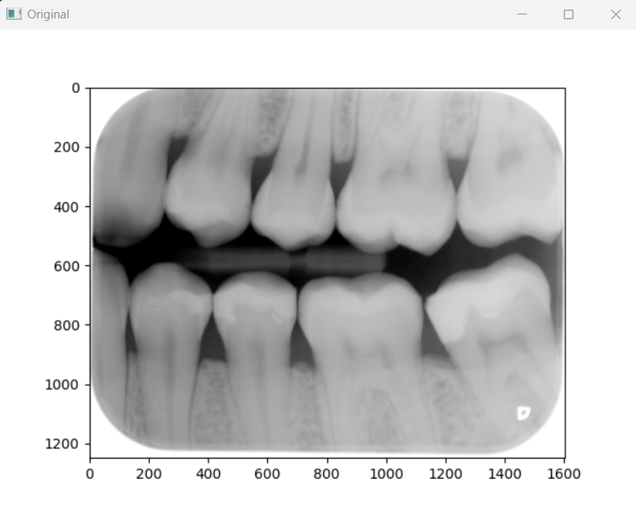

# DICOM Image Processing Tool

Create an application (command line or GUI based) that can be used to display DICOM image as well as perform image processing technique/algorithm to enhance the default image

Requirements:
- [X] Use C++ as main programming language
- [x] Setup project using CMake
- [x] Use any UI framework and/or image processing library where applicable
- [x] Application runs on Windows and/or Linux
- [x] Project code is stored in Git repository (github or Gitlab)
- [x] Provide documentation for anyone to setup, compile and run the application on other machine

- [x] Read and display dental x-ray image file (.jpeg, tiff or .png) from local storage
- [x] Display image histogram information of the dental x-ray image
- [x] Auto rotate the image when displaying whereby the indicator on the image should be on the top left corner

- [ ] Read and display dental x-ray image file using DICOM format (.dcm)
- [ ] Read and display DICOM metadata of the DICOM file from local storage
- [ ] Perform some basic image processing technique to enhance the details of the existing DICOM image

- [x] Write unit test (TDD/BDD)

## Description

This Application developed with C++ and it is setup using CMake. It is console application that can be compiled and run in Windows and Linux. The application will crop, auto rotate and display the given image file `(.jpeg, tiff or .png)` and the histogram.

### How to run

```
DicomImageTool.exe <path/of/image/to/be/loaded>
```
### Results



## How to Setup, Compile and Run
### Installing CMAKE

- Download [cmake](https://cmake.org/download/) for Windows  
- During installation, in installation option select "Add CMake to the system PATH for all users"

### Installing VS C++ Complier
- Install visual studio msvc 2017 [compiler](https://visualstudio.microsoft.com/thank-you-downloading-visual-studio/?sku=Community&channel=Release&version=VS2022&source=VSFeaturesPage&passive=false&cid=2030)

### Setting up project in VS code
Install the Visual Studio extensions:
- CMake Tool Extension [here](https://code.visualstudio.com/docs/cpp/cmake-linux)
- C++ Extension

Follow this setup using these steps:
- Create a folder and open it with Visual Studio
- Configure CMake by Opening command [SHIFT] + [CTRL] + [P] `CMake:Configure`
- Choose the project name and compiler
- Create CMake file `CMakelists.txt` and settings up with command `CMake:Quick Start`

### Setting up Open CV
- Download open CV [here](https://opencv.org/releases/) and extract it.

### DICOM DCMTK Library

- Download [here](https://dicom.offis.de/en/dcmtk/dcmtk-software-development/)
- Configure [here](https://support.dcmtk.org/redmine/projects/dcmtk/wiki/howto_cmakeconfiguration)


